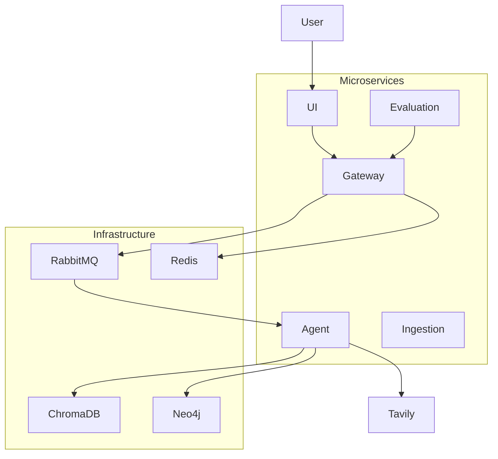
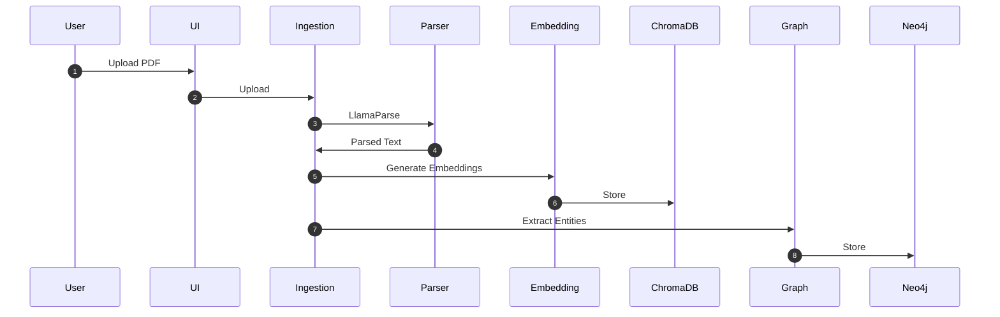
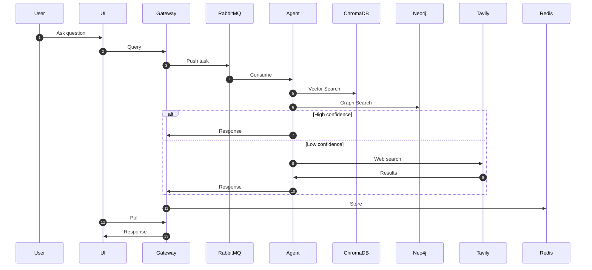
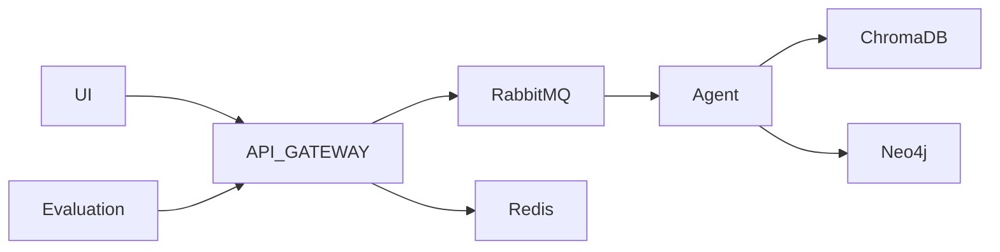
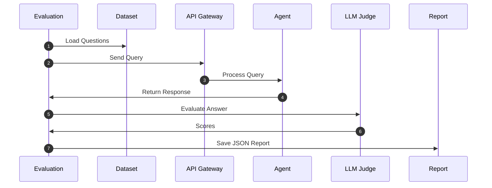
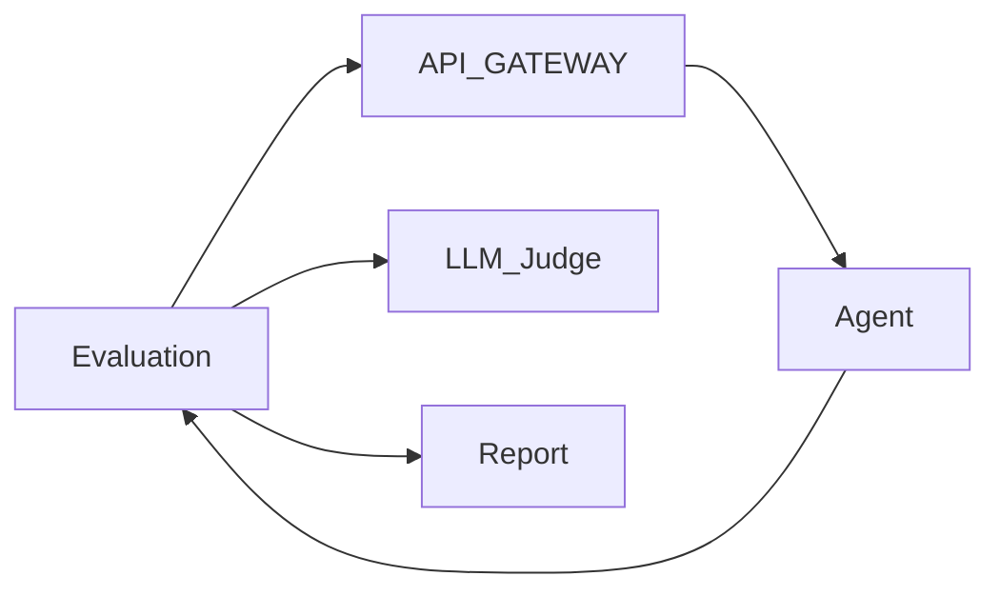
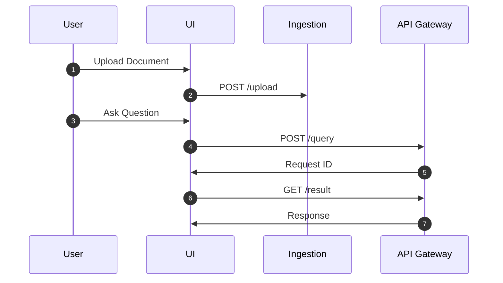
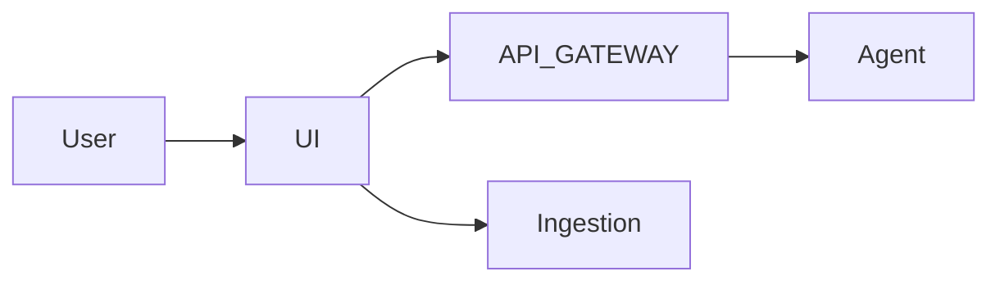

# 🧠 ADEO Hybrid RAG System

## 📌 Overview

**ADEO Hybrid RAG System** is a **production-ready, microservices-based Retrieval Augmented Generation (RAG) platform** designed to intelligently answer questions from **multilingual, handwritten, and electronic documents** using a **Hybrid Retrieval architecture (Vector + Knowledge Graph + Web fallback)**.

The system leverages **LlamaIndex orchestration**, **Groq LLM**, **ChromaDB vector search**, and **Neo4j knowledge graphs** to deliver **accurate, contextual, and grounded responses**.

Additionally, the platform includes a **built-in Evaluation Engine** that automatically assesses the performance of the RAG system using **LLM-based scoring metrics** such as relevance, faithfulness, and accuracy.

---

## 🎯 Purpose

This repository provides a **scalable and production-ready framework** for:

- Building Hybrid RAG systems  
- Processing multilingual documents (Arabic, handwritten, electronic PDFs)  
- Combining vector search with knowledge graphs  
- Implementing microservices-based GenAI architectures  
- Evaluating RAG performance automatically  
- Deploying scalable AI systems using Docker  

---

## ✨ Key Capabilities

- Hybrid Retrieval (Vector + Graph + Web)
- Multilingual Document Support
- Handwritten Document Processing
- Built-in Evaluation Engine
- Microservices Architecture
- Scalable Docker Deployment
- Production-Ready Logging & Monitoring

---

Production-ready **Hybrid RAG Microservices Platform** supporting:

- Vector RAG
- Graph RAG
- Web fallback
- Evaluation engine
- Multilingual documents
- Handwritten PDFs
- Arabic PDFs

---

# 🚀 Key Features

✅ Hybrid RAG (Vector + Graph)  
✅ Evaluation Engine  
✅ Multilingual Support  
✅ Arabic PDF Support  
✅ Handwritten PDF Support  
✅ Dockerized Microservices  
✅ Shared Docker Base Image  
✅ Combined Requirements  
✅ Smart Ingestion  
✅ Duplicate Handling  
✅ Async Processing  
✅ Scalable Architecture  

---

# 🏗️ System Architecture



---

# 📥 Ingestion Service

The **Ingestion Service** is responsible for processing documents and preparing them for retrieval in the Hybrid RAG pipeline.

It converts raw documents into structured data that can be used by:

* Vector Database (ChromaDB)
* Knowledge Graph (Neo4j)

---

## 🎯 Purpose

The ingestion service performs the following tasks:

* Upload documents
* Parse PDFs
* Chunk documents
* Generate embeddings
* Store in vector database
* Extract entities
* Build knowledge graph

---

## ⚙️ How Ingestion Works

1. User uploads documents
2. Documents are parsed using LlamaParse
3. Parsed text is chunked
4. Embeddings are generated
5. Embeddings stored in ChromaDB
6. Entities extracted for knowledge graph
7. Graph stored in Neo4j


---

## 🔌 APIs

### Upload Documents

```
POST /upload
```

Uploads documents for ingestion.

---

### Trigger Ingestion

```
POST /ingest
```

Triggers ingestion pipeline.

---

### Health Check

```
GET /health
```

---

## 📊 Ingestion Flow



---

## 🔁 Duplicate Handling

The ingestion service avoids duplicate indexing by:

* Checking existing files
* Using ingestion cache
* Comparing file hashes

This improves performance and avoids redundant indexing.

---

## 🐳 Container

Service:

```
services/ingestion
```

Container:

```
adeo_ingestion
```

Port:

```
8002
```

---

## 🧠 Why Separate Ingestion Service

Separating ingestion provides:

* Independent scaling
* Batch ingestion
* Better performance
* Cleaner architecture

---


# 🔁 Query Flow



---

# 🧠 Models Used

## 🔎 Embedding Model  
**intfloat/multilingual-e5-small**

### Why this model?

- 🌍 **Multilingual Support** — Handles Arabic, English, and mixed-language documents  
- ✍️ **Better OCR Compatibility** — Works well with handwritten and noisy text extracted from PDFs  
- ⚡ **Lightweight & Fast** — Small model size enables faster ingestion and retrieval  
- 💻 **On-Prem Friendly** — Can be deployed locally without heavy GPU requirements  
- 🔄 **Flexible** — Can easily be replaced with larger models (e.g., `bge-m3`, `e5-large`, etc.) if higher accuracy is needed  

This makes the model ideal for:

- Arabic PDFs  
- Handwritten PDFs  
- Electronic PDFs  
- Multilingual documents  

---

## 🤖 LLM  
**llama-3.3-70b-versatile (via Groq)**

### Why this model?

- 🔐 **API Security** — Groq provides secure and reliable API infrastructure  
- 💰 **Low Cost** — More cost-efficient compared to many hosted LLM providers  
- ⚡ **High Performance** — Extremely fast inference using Groq hardware  
- 🔓 **Open-Source Model** — Based on open models allowing flexibility  
- 🏢 **On-Prem Replication** — Can be replicated locally or deployed on-prem if required  
- 📈 **Strong RAG Performance** — Good reasoning and grounding capabilities for RAG systems  

Used for:

- Query Answering  
- Graph Extraction  
- Context Condensation  
- Web Search Synthesis  
- Evaluation Engine (LLM-as-a-Judge)

---

---

# 📄 Supported Document Types

This system supports:

1. Arabic PDF  
2. Handwritten PDF  
3. Electronic PDF  
4. Electronic PDF  

---

---
# 📄 Document Parsing

## 🧩 Parser Used  
**LlamaParse**

### Why LlamaParse?

LlamaParse was selected as the document parsing engine due to its ability to handle **complex and diverse PDF formats** effectively.

### Key Advantages

- 📝 **Handwritten Document Support**  
  Accurately extracts text from handwritten PDFs using advanced parsing capabilities.

- 🌍 **Multilingual Support**  
  Works well with **Arabic**, **English**, and mixed-language documents.

- 📊 **Complex Layout Handling**  
  Supports:
  - Tables  
  - Multi-column layouts  
  - Headers & footers  
  - Structured documents  

- 📄 **Better than Traditional OCR**  
  Produces cleaner structured output compared to standard OCR tools.

- 🔗 Optimized for **LlamaIndex Integration**  
  Directly integrates with LlamaIndex ingestion pipelines.

- ⚡ **High Quality Markdown Output**  
  Converts documents into structured markdown for better chunking and retrieval.

### Why it fits this project

The ADEO Hybrid RAG system processes:

- Arabic PDFs  
- Handwritten PDFs  
- Electronic PDFs  
- Mixed-format documents  

LlamaParse provides **robust and consistent parsing** across all these document types, making it ideal for the ingestion pipeline.

---
# 🧠 Framework Used

## ⚙️ LlamaIndex

The ADEO Hybrid RAG System uses **LlamaIndex** as the core orchestration framework to build and manage the **Hybrid Retrieval-Augmented Generation (RAG)** pipeline.

LlamaIndex acts as the **central layer** connecting:

* Document parsing
* Embedding generation
* Vector database (ChromaDB)
* Knowledge graph (Neo4j)
* LLM (Groq)
* Query engine
* Memory management

---

## 🏗️ How LlamaIndex is Used

LlamaIndex is used across multiple stages of the pipeline:

### 1. Document Ingestion

LlamaIndex is used to:

- Convert parsed documents into structured nodes
- Chunk documents intelligently
- Generate embeddings
- Store embeddings in ChromaDB
- Extract entities for Neo4j graph

Components used:

- `Document`
- `TokenTextSplitter`
- `VectorStoreIndex`
- `PropertyGraphIndex`

---

### 2. Hybrid Retrieval (Vector + Graph)

LlamaIndex enables hybrid retrieval using:

- Vector Search → ChromaDB
- Graph Search → Neo4j

This is implemented using:

```python
PropertyGraphIndex.from_existing()
```

This allows the system to retrieve:

- Semantic matches (vector search)
- Entity relationships (graph search)

---

### 3. Query Engine

LlamaIndex provides the chat-based query engine:

```python
chat_engine = index.as_chat_engine()
```

Features:

- Conversational queries
- Context-aware responses
- Memory support
- Hybrid retrieval

---

### 4. Memory Management

LlamaIndex provides conversation memory using:

```python
ChatMemoryBuffer
```

This enables:

- Multi-turn conversations
- Context retention
- Better query understanding

---

### 5. Embedding Integration

LlamaIndex integrates embedding models easily:

```python
Settings.embed_model
```

Used for:

* Multilingual embeddings
* Semantic retrieval

---

### 6. LLM Integration

LlamaIndex integrates with Groq:

```python
Settings.llm = Groq(...)
```

Used for:

- Answer generation
- Graph extraction
- Query rewriting
- Evaluation

---

## 🎯 Why LlamaIndex Was Chosen

### 1. Native RAG Framework

LlamaIndex is designed specifically for:

- RAG pipelines
- Document intelligence
- Knowledge retrieval

---

### 2. Hybrid Retrieval Support

Supports:

- Vector Search
- Graph Search
- Hybrid Retrieval

This was essential for ADEO Hybrid RAG.

---

### 3. Easy Multi-DB Integration

LlamaIndex integrates easily with:

- ChromaDB
- Neo4j
- Redis
- External APIs

---

### 4. Modular Architecture

LlamaIndex allows:

- Swappable models
- Swappable databases
- Swappable parsers

This keeps the architecture flexible.

---

### 5. Production Ready

LlamaIndex supports:

- Scalable pipelines
- Memory management
- Query orchestration
- Hybrid retrieval

---

## 🚀 Benefits in This Project

Using LlamaIndex enabled:

- Hybrid RAG architecture
- Faster development
- Cleaner architecture
- Better retrieval accuracy
- Modular design

---

## 🧠 Summary

LlamaIndex acts as the **central intelligence layer** of the ADEO Hybrid RAG system, orchestrating:

* Parsing
* Chunking
* Embedding
* Retrieval
* Memory
* LLM interaction

This makes the system **modular, scalable, and production-ready**.

---

# 🧩 Services & Infrastructure

The ADEO Hybrid RAG system is built using a **microservices architecture** where each component runs in **separate Docker containers**. This ensures modularity, scalability, and easier maintenance.

---

## 🐳 Containerized Architecture

Each infrastructure and service component runs in its **own Docker container**:

### Infrastructure Containers

* **ChromaDB** — Vector Database
* **Neo4j** — Knowledge Graph Database
* **Redis** — Result Cache
* **RabbitMQ** — Message Queue

### Service Containers

* **UI Service** — Streamlit frontend
* **API Gateway** — Request orchestration
* **Agent Service** — Hybrid RAG processing
* **Ingestion Service** — Document ingestion
* **Evaluation Service** — RAG evaluation engine

---

## 🎯 Why Separate Containers?

Running each component in separate containers provides:

* Modular architecture
* Independent scaling
* Fault isolation
* Easier debugging
* Cleaner deployments
* Better maintainability

For example:

* Agent service can scale independently
* Evaluation service can run only when required
* Databases remain persistent

---

## 🐳 Shared Base Docker Image

All services use a **common base Docker image**:

```
Dockerfile.base
```

Each service Dockerfile inherits from:

```
FROM adeo-base:latest
```

### Advantages

* Avoids duplicate dependency installation
* Faster builds
* Smaller image sizes
* Consistent environments
* Easier maintenance

This ensures that dependencies from:

```
requirements.txt
```

are installed only **once** and shared across all services.

---

# 🔧 Services & Ports

| Service     | Container        | Port         | Description             |
| ----------- | ---------------- | ------------ | ----------------------- |
| UI          | adeo_ui          | 8501         | Streamlit UI            |
| API Gateway | adeo_api_gateway | 8001         | Entry point for queries |
| Ingestion   | adeo_ingestion   | 8002         | Document ingestion      |
| Evaluation  | adeo_evaluation  | 8003         | RAG evaluation          |
| ChromaDB    | adeo_chromadb    | 8000         | Vector DB               |
| Neo4j       | adeo_neo4j       | 7474 / 7687  | Graph DB                |
| Redis       | adeo_redis       | 6379         | Cache                   |
| RabbitMQ    | adeo_rabbitmq    | 5672 / 15672 | Queue                   |

---

# 🔌 APIs Exposed

## API Gateway

### Submit Query

```
POST /query
```

### Get Result

```
GET /result/{request_id}
```

### Health Check

```
GET /health
```

---

## Ingestion Service

### Upload File

```
POST /upload
```

### Trigger Ingestion

```
POST /ingest
```

### Health

```
GET /health
```

---

## Evaluation Service

### Trigger Evaluation

```
POST /trigger_evaluation
```

### Get Evaluation Report

```
GET /report
```

---

## UI Service

* Upload documents
* Query system
* View citations

---

## Agent Service

Agent service is an internal worker that:

* Consumes RabbitMQ messages
* Performs Hybrid RAG
* Calls LLM
* Returns results to API Gateway

This service does not expose external APIs.

---

# 🧠 Microservices Flow



---

# 📊 Evaluation Engine

The ADEO Hybrid RAG system includes a **dedicated Evaluation Service** to automatically assess the performance of the RAG pipeline.

The evaluation engine runs as a **separate microservice** and communicates with the **API Gateway** to test the system end‑to‑end.

---

## 🎯 Purpose of Evaluation Engine

The evaluation engine is used to:

* Measure RAG performance
* Identify hallucinations
* Validate retrieval quality
* Benchmark system improvements
* Compare model performance
* Track system accuracy over time

---

## 🧩 Evaluation Service Architecture

The evaluation engine runs as a **separate Docker container**:

```
services/evaluation
```

Container:

```
adeo_evaluation
```

Port:

```
8003
```

---

## ⚙️ How Evaluation Works

The evaluation engine:

1. Loads evaluation dataset
2. Sends queries to API Gateway
3. Retrieves generated responses
4. Uses LLM as judge
5. Scores responses
6. Generates evaluation report

---

## 📊 Evaluation Flow



---

### eval_dataset.json

Contains:

* Questions
* Ground truth answers

### evaluation_report.json

Generated report containing:

* Scores
* Latency
* Responses
* Summary metrics

---

## 🧠 LLM‑as‑a‑Judge

The evaluation engine uses:

```
llama-3.3-70b-versatile
```

This model evaluates:

* Relevance
* Faithfulness
* Accuracy

---

## 📈 Evaluation Metrics

### Relevance

Does the answer address the user question?

### Faithfulness

Is the answer grounded in retrieved context?

Detects hallucinations.

### Accuracy

Does answer match ground truth?

### Latency

Measures system response time.

---

## 🔌 Evaluation APIs

### Trigger Evaluation

```
POST /trigger_evaluation
```

Runs evaluation in background.

---

### Get Evaluation Report

```
GET /report
```

Returns generated report.

---

## 🚀 Why Separate Evaluation Service?

Running evaluation as a separate service provides:

* Independent benchmarking
* No impact on production queries
* Scalable evaluation
* Batch testing
* Model comparison

---

## 🧠 Evaluation Architecture



---
# 🖥️ UI Service

The **UI Service** provides a simple and interactive interface to interact with the **ADEO Hybrid RAG System**. It is built using **Streamlit** and allows users to upload documents, query the system, and view responses.

---

## 🎯 Purpose

The UI Service enables users to:

* Upload documents
* Trigger ingestion
* Ask questions
* View responses
* Monitor system status

---

## ⚙️ Features

### 📄 Document Upload

Users can upload:

* Arabic PDFs
* Handwritten PDFs
* Electronic PDFs
* Multilingual documents

Uploaded files are sent to the **Ingestion Service** for processing.

---

### 💬 Query Interface

Users can ask questions using the chat interface.

The UI sends queries to the **API Gateway**, which then triggers the Hybrid RAG pipeline.

---

### 📊 Response Display

The UI displays:

* Generated answers
* Citations (if enabled)
* Processing status

---

### 🔄 Status Updates

The UI polls the API Gateway to:

* Check request status
* Retrieve results

This ensures **non-blocking query execution**.

---

## 🔌 UI Communication Flow



---

## 🐳 Container

Service Location:

```
services/ui
```

Container Name:

```
adeo_ui
```

Port:

```
8501
```

Access URL:

```
http://localhost:8501
```

---

## 🧠 Why Streamlit?

Streamlit was chosen because:

* Fast UI development
* Lightweight
* Python-based
* Easy integration with backend services
* Suitable for internal tools

---

## 🧩 UI Role in Architecture

The UI acts as the **entry point** for users and connects to:

* API Gateway
* Ingestion Service

This keeps the UI lightweight and stateless.

---

## 🧠 UI Architecture



---

# 🚀 Getting Started

This section explains how to **set up the repository**, **start services**, **ingest documents**, and **query the system**.
THis section is detailed in a separate file with the name `Readme_Setup.md`.