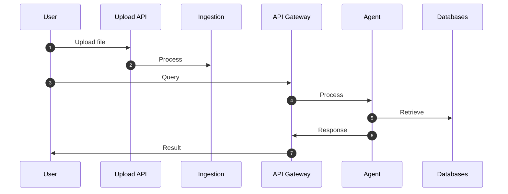

# 🚀 Getting Started

This section explains how to **set up the repository**, **start services**, **ingest documents**, and **query the system**.

---

# 📦 Repository Setup

## 1. Clone Repository

```bash
git clone <repo_url>
cd <repo_name>
```

---

## 2. Configure Environment Variables

Create a `.env` file in the root directory:

```bash
GROQ_API_KEY=
TAVILY_API_KEY=
LLAMA_CLOUD_API_KEY=
NEO4J_PASSWORD=
```

---

# 🐳 Start the System

## Option 1 — Using Startup Scripts (Recommended)

### Linux / Mac

```bash
./start.sh
```

### Windows

```powershell
./start.ps1
```

This will:

* Build base Docker image
* Start infrastructure containers
* Start all services

---

# 🛠 Manual Setup (Optional)

## 1. Create Docker Network

```bash
docker network create adeo_network
```

## 2. Build Base Docker Image

```bash
docker build -t adeo-base -f Dockerfile.base .
```

## 3. Start Infrastructure

```bash
docker-compose -f infra/rabbitmq/docker-compose.yml up -d

docker-compose -f infra/redis/docker-compose.yml up -d

docker-compose -f infra/chromadb/docker-compose.yml up -d

docker-compose -f infra/neo4j/docker-compose.yml up -d
```

## 4. Start Services

```bash
docker-compose -f services/api_gateway/docker-compose.yml up -d

docker-compose -f services/agent/docker-compose.yml up -d

docker-compose -f services/ingestion/docker-compose.yml up -d

docker-compose -f services/evaluation/docker-compose.yml up -d

docker-compose -f services/ui/docker-compose.yml up -d
```

---

# 📥 Start Ingestion

## Upload Documents

Use the UI or API:

```
POST /upload
```

---

## Trigger Ingestion

```
POST /ingest
```

This will:

* Parse documents
* Generate embeddings
* Store in ChromaDB
* Build Knowledge Graph

---

# 🖥️ Start UI

Once services are running, open:

```
http://localhost:8501
```

From the UI you can:

* Upload documents
* Trigger ingestion
* Query system

---

# 🔍 Query the System

## From UI

1. Open UI
2. Enter query
3. Submit
4. View response

---

## From API

### Submit Query

```
POST /query
```

---

### Get Result

```
GET /result/{request_id}
```

---

# 🔌 API Usage with cURL

This section provides **cURL commands** for interacting with the system.

---

# 📥 Upload Documents

Upload documents to ingestion service:

```bash
curl -X POST http://localhost:8002/upload \
  -F "file=@sample.pdf"
```

---

# 🚀 Trigger Ingestion

```bash
curl -X POST http://localhost:8002/ingest
```

---

# 🔍 Query the System

Submit query:

```bash
curl -X POST http://localhost:8001/query \
  -H "Content-Type: application/json" \
  -d '{
        "query": "What is the document about?"
      }'
```

---

# 📊 Get Query Result

```bash
curl http://localhost:8001/result/<request_id>
```

---

# 🩺 Health Check — Ingestion Service

```bash
curl http://localhost:8002/health
```

---

# 🩺 Health Check — API Gateway

```bash
curl http://localhost:8001/health
```

---

# 🩺 Health Check — Agent Service

Agent service typically runs as a worker, but if health endpoint is exposed:

```bash
curl http://localhost:8004/health
```

---

# 🐳 Docker Container Status

Check running containers:

```bash
docker ps
```

---

# 📊 Check Logs

## Ingestion Logs

```bash
docker logs -f adeo_ingestion
```

---

## API Gateway Logs

```bash
docker logs -f adeo_api_gateway
```

---

## Agent Logs

```bash
docker logs -f adeo_agent
```

---

# 🔄 End-to-End Flow



---

# 🌐 Service URLs

| Service     | URL                                              |
| ----------- | ------------------------------------------------ |
| UI          | [http://localhost:8501](http://localhost:8501)   |
| API Gateway | [http://localhost:8001](http://localhost:8001)   |
| Ingestion   | [http://localhost:8002](http://localhost:8002)   |
| Evaluation  | [http://localhost:8003](http://localhost:8003)   |
| Neo4j       | [http://localhost:7474](http://localhost:7474)   |
| RabbitMQ    | [http://localhost:15672](http://localhost:15672) |

---
